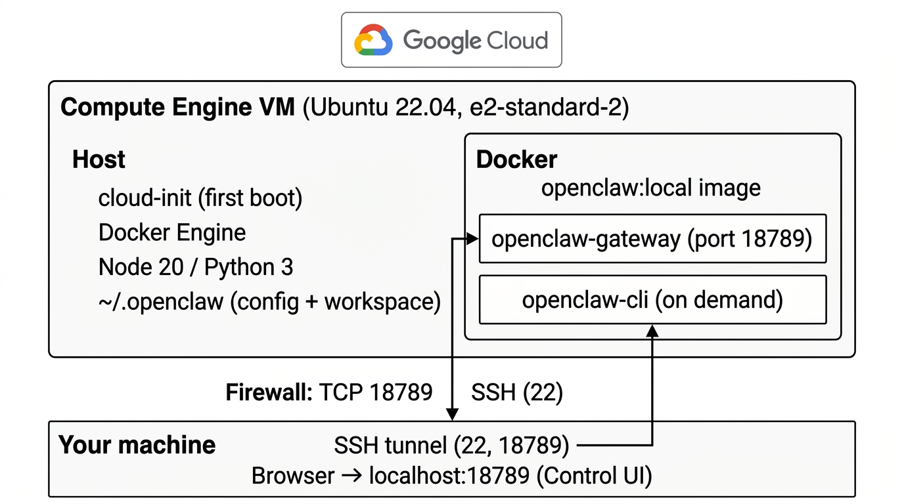

# Clawless

**Repeatable [OpenClaw](https://github.com/openclaw/openclaw) deployment in under 5 minutes.** Clawless is an open source project that provides safe, repeatable ways to deploy OpenClaw in the cloud — without hardcoding secrets in public configs and with clear separation between code and credentials.

Do the **initial setup once** (Terraform + `cloud-init.yaml`); after that, **no additional setup is required**. Run `terraform apply` and your VM comes up with OpenClaw built and running. No manual install steps, no post-boot configuration. As many instances as you want.

This repo now supports **Google Cloud** (root Terraform) and **Azure**
(`azure/` Terraform). Both variants use the same model: Terraform provisions a
single Ubuntu VM and `cloud-init.yaml` bootstraps OpenClaw. This keeps provider
differences isolated while preserving one shared OpenClaw setup path.

## Keeping it safe

OpenClaw is powerful — it can act on your behalf across messaging, code, and deployment platforms. That power requires care.

### Messaging channels (WhatsApp, Telegram)

Connecting via WhatsApp or Telegram is **relatively safe** as long as:

- **Communication is isolated to you (the admin).** The default config restricts the bot to an allowlist of your user ID only. No group chats, no strangers.
- **You don't give the model access to read arbitrary messages.** As long as interaction flows through a dedicated bot conversation that only you control, the attack surface is small.

WhatsApp (via the Control UI bridge) is the **fastest and easiest** way to interact with your deployment on the go. Telegram works the same way with the built-in bot plugin.

### What to be careful with

- **E-mail access is a security risk.** Incoming emails from unknown senders can contain prompt injections — crafted text that tricks the model into performing unintended actions. Avoid giving OpenClaw read access to inboxes that receive external mail.
- **Broad communication access.** Any integration that lets the model freely read messages from other people (group chats, shared inboxes, public channels) increases the risk of prompt injection. Keep access scoped and read-only where possible.
- **API tokens with wide permissions.** Give each token the minimum scope it needs. A GitHub PAT with full repo access is more dangerous than one scoped to a single repository.

### Rule of thumb

The default Clawless config is conservative: admin-only messaging, no email, scoped tokens. **Don't loosen these defaults unless you understand the implications.**

### Architecture



**Why a full VM instead of just a Docker container?** OpenClaw is designed to run persistently — it uses internal triggers, scheduled tasks, and background processes (e.g. cron-style hooks, session memory, Telegram polling) that need to stay alive. A standalone container on a serverless platform would be put to sleep when idle, breaking these features. A dedicated VM keeps the gateway running 24/7 so OpenClaw can act on triggers, respond to messages, and run scheduled tasks even when you're not actively connected.

- **GCP:** One Compute Engine VM (Ubuntu 22.04). Firewall allows SSH (22) and OpenClaw gateway (18789).
- **VM host:** cloud-init runs on first boot (Docker, Node, Python, OpenClaw clone). Config and workspace live at `~/.openclaw`.
- **Docker:** Single image `openclaw:local`. Long-running **openclaw-gateway** (port 18789); **openclaw-cli** runs on demand (e.g. dashboard, pairing).
- **You:** SSH tunnel to the VM, then open `http://localhost:18789` for the Control UI. No direct public exposure of the UI.

## Deploy

Choose one stack:

- **GCP (default):** use repo root.
- **Azure:** use `azure/` and follow [Azure deployment guide](azure/README.md).

1. **Prerequisites (GCP path):** [Terraform](https://www.terraform.io/downloads)
   ≥ 1.5, [gcloud](https://cloud.google.com/sdk/docs/install) configured, SSH
   key at `~/.ssh/id_ed25519.pub` (or set `public_key_path` in tfvars).

2. **Configure:** Copy the example files, then follow the [Tutorial: Setting up cloud-init.yaml](#tutorial-setting-up-cloud-inityaml) below. Also set your GCP project:
   ```bash
   cp terraform.tfvars.example terraform.tfvars
   cp cloud-init.yaml.example cloud-init.yaml
   ```
   - Edit `terraform.tfvars`: set `project_id = "your-gcp-project-id"`.
   - Edit `cloud-init.yaml`: replace every `your-*` placeholder (see tutorial). **Never commit `cloud-init.yaml`** — it stays local and gitignored.

3. **Apply:**
   ```bash
   terraform init
   terraform plan
   terraform apply
   ```
   First boot can take 15–20 minutes while the OpenClaw image builds. Subsequent runs are much faster.

4. **SSH:** Use the `ssh_command` output, e.g. `ssh dev@<nat_ip>`.

### Security note (applies to both providers)

Parity defaults expose port `18789` publicly for fast setup. Recommended
hardening is SSH tunnel-only access to the Control UI (`localhost:18789`) and
no public gateway ingress.

## Tutorial: Setting up cloud-init.yaml

After copying `cloud-init.yaml.example` to `cloud-init.yaml`, open `cloud-init.yaml` and replace the following placeholders. Use your editor’s search (e.g. search for `your-`) to find each one.

### Required (default model is Azure OpenAI)

| Placeholder | Variable | Where to get it |
|-------------|----------|------------------|
| `your-azure-openai-api-key` | `AZURE_OPENAI_API_KEY` | Azure Portal → your Azure OpenAI resource → **Keys and Endpoint** → KEY 1. |
| `your-azure-openai-endpoint` | `AZURE_OPENAI_ENDPOINT` | Same page → **Endpoint** (e.g. `https://<resource>.openai.azure.com/`). |

Replace **every** occurrence of `your-azure-openai-api-key` and `your-azure-openai-endpoint` in the file (there are two of each: one in the `echo` block, one in the `ENVEOF` block). The default primary model is `azure-openai-responses/gpt-5.5`.

### Optional: direct OpenAI (fallback)

| Placeholder | Variable | Where to get it |
|-------------|----------|------------------|
| `your-openai-api-key` | `OPENAI_API_KEY` | [OpenAI API keys](https://platform.openai.com/api-keys). Used as fallback if Azure OpenAI is unreachable. |

Replace **every** occurrence of `your-openai-api-key` in the file (there are two: one in the `echo` block, one in the `ENVEOF` block). If you don't need a fallback, leave the placeholder or set a dummy value.

### Optional: other model (Gemini)

| Placeholder | Variable | Where to get it |
|-------------|----------|------------------|
| `your-google-api-key` | `GEMINI_API_KEY` | [Google AI Studio](https://aistudio.google.com/apikey). Only needed if you change the default model to Gemini or use Gemini in skills. |

If you don’t use Gemini, you can leave the placeholder or set a dummy value; the default config uses OpenAI only.

### Optional: plugins and integrations

| Placeholder | Variable | Where to get it |
|-------------|----------|------------------|
| `your-telegram-bot-token` | `TELEGRAM_BOT_TOKEN` | [@BotFather](https://t.me/BotFather) on Telegram. Required only if you use the Telegram plugin. |
| `your-telegram-user-id` | (in `openclaw.json`) | Your Telegram user ID (e.g. from [@userinfobot](https://t.me/userinfobot)). Used in `channels.telegram.allowFrom` so the bot accepts your DMs. |
| `your-notion-api-key` | `NOTION_API_KEY` | [Notion integrations](https://www.notion.so/my-integrations). For the Notion skill. |
| `your-vercel-token` | `VERCEL_TOKEN` | [Vercel account tokens](https://vercel.com/account/tokens). For Vercel-related tools. |
| `your-vapi-api-key` | `VAPI_API_KEY` | [VAPI dashboard](https://dashboard.vapi.ai). For voice/API integrations. |
| `your-github-pat` | `GITHUB_TOKEN` | [GitHub Personal Access Token](https://github.com/settings/tokens). For repo access from OpenClaw. |
| `your-apify-token` | `APIFY_TOKEN` | [Apify console](https://console.apify.com/account/integrations). For Apify actors. |

Replace each placeholder only if you use that integration. For unused ones you can leave the placeholder or a dummy value.

### Checklist

1. Copy: `cp cloud-init.yaml.example cloud-init.yaml`
2. Set **at least** `your-azure-openai-api-key` and `your-azure-openai-endpoint` everywhere they appear.
3. Optionally set `your-openai-api-key` everywhere it appears (used as fallback).
4. Set `your-telegram-user-id` in the `openclaw.json` block if you use Telegram (search for `"allowFrom": ["your-telegram-user-id"]` and put your numeric user ID in the list).
5. Set any other `your-*` values you need for plugins/skills.
6. Save. Do **not** commit `cloud-init.yaml`.

## OpenClaw on the VM

- **Onboarding:** Skipped automatically — `cloud-init.yaml` pre-seeds a full onboarded config from your `.env` values. No wizard to run after boot.
- **Config/workspace:** `~/.openclaw` and `~/.openclaw/workspace` on the VM; gateway runs as a container from `/opt/openclaw`.

### Accessing the Control UI

The Control UI requires HTTPS or localhost (secure context), so you **must** use an SSH tunnel:

```bash
gcloud compute ssh dev@cloud-automation-dev --zone=europe-west3-a -- -N -L 18789:localhost:18789
```

Keep that running, then open **http://localhost:18789** in your browser.

### First-time device pairing

On a fresh deployment, the Control UI will show `disconnected (1008): pairing required`. This is because no browser devices have been approved yet.

1. Get a dashboard link with auto-auth:
   ```bash
   gcloud compute ssh dev@cloud-automation-dev --zone=europe-west3-a \
     --command="cd /opt/openclaw && docker compose run --rm openclaw-cli dashboard --no-open"
   ```
   Open the printed `http://localhost:18789/#token=...` URL.

2. If that still fails (CLI itself needs pairing — chicken-and-egg), approve pending devices manually:
   ```bash
   gcloud compute ssh dev@cloud-automation-dev --zone=europe-west3-a --command="python3 -c \"
   import json, secrets
   pending = json.load(open('/home/dev/.openclaw/devices/pending.json'))
   paired = {}
   for rid, req in pending.items():
       paired[req['deviceId']] = {
           'deviceId': req['deviceId'], 'publicKey': req['publicKey'],
           'platform': req['platform'], 'clientId': req['clientId'],
           'role': req['role'], 'roles': req['roles'], 'scopes': req['scopes'],
           'token': secrets.token_hex(32), 'pairedAt': req['ts']
       }
   with open('/home/dev/.openclaw/devices/paired.json', 'w') as f:
       json.dump(paired, f, indent=2)
   with open('/home/dev/.openclaw/devices/pending.json', 'w') as f:
       json.dump({}, f)
   print('Approved', len(paired), 'devices')
   \""
   ```
   Then restart the gateway:
   ```bash
   gcloud compute ssh dev@cloud-automation-dev --zone=europe-west3-a \
     --command="cd /opt/openclaw && docker compose restart openclaw-gateway"
   ```
   Refresh `http://localhost:18789` — it should connect.

### Token + pairing requirements (important)

- The Control UI auth token is tied to the current deployment and device pairing state.
- After `terraform destroy`/`apply` (or manual device file reset), old browser tokens become invalid.
- Access must be through `localhost` (SSH tunnel) or HTTPS; direct public HTTP is not a secure context.
- Keep one active browser session during first connect to avoid stale token/device collisions.

#### Common errors and fixes

- **`disconnected (1008): pairing required`**
  - No device is paired yet. Use the "First-time device pairing" steps above.
- **`disconnected (1008): unauthorized: device token mismatch (rotate/reissue device token)`**
  1. Generate a fresh dashboard token URL:
     ```bash
     gcloud compute ssh dev@cloud-automation-dev --zone=europe-west3-a \
       --command="cd /opt/openclaw && docker compose run --rm openclaw-cli dashboard --no-open"
     ```
  2. Open the printed `http://localhost:18789/#token=...` URL in your tunneled browser session.
  3. If it still fails, clear site data for `localhost:18789` or use an Incognito window, then retry the token URL.
  4. If needed, run the manual approval snippet from "First-time device pairing", then restart:
     ```bash
     gcloud compute ssh dev@cloud-automation-dev --zone=europe-west3-a \
       --command="cd /opt/openclaw && docker compose restart openclaw-gateway"
     ```

### API prerequisites

- **Azure OpenAI (default):** The default model is `azure-openai-responses/gpt-5.5`; set `AZURE_OPENAI_API_KEY` and `AZURE_OPENAI_ENDPOINT` in `cloud-init.yaml` (required). Create an Azure OpenAI resource and deploy a model via [Azure AI Foundry](https://ai.azure.com/).
- **OpenAI (fallback):** Set `OPENAI_API_KEY` if you want direct OpenAI as a fallback. Optional if Azure OpenAI is your only provider.
- **Google/Gemini (optional):** Only needed if you switch the model to Gemini or use it as a fallback. Enable the [Generative Language API](https://console.developers.google.com/apis/api/generativelanguage.googleapis.com/overview) in your GCP project and set `GEMINI_API_KEY`.
- **Anthropic/Claude:** Coming soon (see [Roadmap](#roadmap)).

## What you can do with it

Once deployed, OpenClaw is a cloud-based AI agent you can interact with from anywhere.

### Chat from your phone (WhatsApp / Telegram)

The fastest way to use your deployment. Connect WhatsApp through the Control UI bridge or Telegram via the built-in bot plugin. Send a message, get a response — no laptop needed. This is ideal for quick tasks, questions, and on-the-go use.

### Build and deploy apps (GitHub + Vercel)

Connect your GitHub PAT and Vercel token, and OpenClaw can create repositories, write code, push commits, and deploy to Vercel — all from a chat message. Prototype a new app, fix a bug, or ship an update from your phone.

### Manage knowledge (Notion)

With the Notion integration, OpenClaw can read and write to your Notion workspace — useful for note-taking, knowledge management, and structured data tasks.

### Web research (Apify)

Connect Apify to give OpenClaw the ability to scrape and extract structured data from the web.

## Repo contents

- **Terraform:** `main.tf`, `variables.tf`, `outputs.tf`, `versions.tf` — one Ubuntu 22.04 VM in `europe-west3`; firewall allows TCP 18789 for OpenClaw.
- **Azure Terraform:** `azure/main.tf`, `azure/variables.tf`,
  `azure/outputs.tf`, `azure/versions.tf` — one Ubuntu 22.04 VM with NSG rules
  for SSH and gateway parity.
- **cloud-init.yaml.example** — template for cloud-init: Docker, Docker Compose, Node 20, Python 3, dev tools; clones OpenClaw, builds the image, and starts the gateway. Copy to `cloud-init.yaml` (gitignored) and fill in your keys.

`cloud-init.yaml`, `.terraform/`, `*.tfstate*`, and `*.tfvars` are gitignored
for both stacks. Keep secrets only in local `cloud-init.yaml` and local tfvars.

## Switching clouds safely

Keep state isolated (`/` for GCP, `azure/` for Azure), then:

1. Apply target cloud.
2. Verify SSH tunnel + UI.
3. Destroy old cloud stack to avoid duplicate runtime cost.

## Cost estimate

With the default settings (`e2-standard-2`, 50 GB SSD, `europe-west3`), the server costs roughly **~$50/month** to run 24/7:

| Resource | Spec | ~Monthly cost |
|----------|------|---------------|
| Compute (e2-standard-2) | 2 vCPU, 8 GB RAM | ~$49 |
| Boot disk (pd-ssd) | 50 GB | ~$8.50 |
| Network egress | Minimal (SSH tunnel) | ~$0 |
| **Total** | | **~$57** |

This does **not** include API costs for the LLM (OpenAI, Gemini, etc.) — those depend entirely on your usage. To reduce server costs, stop the VM when not in use (`gcloud compute instances stop cloud-automation-dev --zone=europe-west3-a`) or switch to a smaller machine type like `e2-medium` (~$25/month).

### Controlling API spend

We recommend using an API provider like **OpenAI** (or Anthropic/Claude when supported) where you can **prepay a fixed credit balance** (e.g. $10–$20) rather than a provider that bills you on open-ended usage. With a prepaid balance, the model simply stops working when credits run out — giving you a hard budgetary safety net. This prevents runaway costs from unexpected loops or heavy usage. Top up only when you need to.

## Disclaimer

**This is an open source project provided as-is — use at your own risk.** We do not take any responsibility for actions taken by or resulting from your use of this deployment, including but not limited to cloud costs, API charges, data loss, security incidents, or unintended actions performed by the AI model. Infrastructure, cloud resources, and API usage are entirely under your control. Use Clawless only if you have the necessary expertise in Terraform, cloud infrastructure, Docker, networking, and secret management, and exercise appropriate care at every step.

## License and contributing

Clawless is **open source** under the [MIT License](LICENSE). Safe deployment patterns for OpenClaw (like example configs and Terraform) belong in this repo; secrets and keys stay in your local `cloud-init.yaml` and `terraform.tfvars` only.

## Roadmap

- **Claude (Anthropic) support** — add Claude as a model option alongside OpenAI and Gemini.
- **Open source models** — support for self-hosted models (e.g. Llama, Mistral) via local inference or API-compatible endpoints.
- **Voice integration** — talk to your OpenClaw deployment using voice input/output (via VAPI or similar).
- **More multi-cloud templates** — add an AWS variant alongside GCP + Azure.
- **Secrets via Terraform variables** — move API keys out of `cloud-init.yaml` into `terraform.tfvars` with `templatefile()` injection, making the cloud-init file a secret-free template safe to commit.
